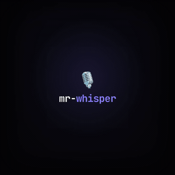

# mr-whisper 🎙️

**System-wide voice dictation for Linux — local, free, and private.** A [Wispr Flow](https://wisprflow.ai/) alternative for Linux (which Wispr doesn't support).

Hold a hotkey, speak, release. Your speech is transcribed on your GPU with [`faster-whisper`](https://github.com/SYSTRAN/faster-whisper) and pasted into whatever text field is focused — terminal, editor, browser, any app. No cloud, no API keys, no subscription. Your audio never leaves your machine.


-purple.svg)

---

## Demo

https://github.com/MrIago/mr-whisper/releases/download/v0.1.0/mr-whisper-demo.mp4

<p align="center">
  <a href="https://github.com/MrIago/mr-whisper/releases/download/v0.1.0/mr-whisper-demo.mp4">
    
  </a>
</p>

> _Hold `Ctrl+Alt+Space`, speak in Portuguese or English (mixed is fine), release. The text appears where your cursor is._ ▸ 🎤 waveform reacts to your voice ▸ ⟳ transcribing on your GPU ▸ ✓ text pasted at the cursor.

## Why

Wispr Flow is great but it's paid (~$15/mo), cloud-based, and has no Linux build. I wanted the same "press, talk, it types" experience — but running fully offline on my own GPU, for free. So I built it.

## How it works

Three decoupled processes so the UI never freezes during the heavy work:

| Component | Role |
|---|---|
| **`daemon.py`** | Reads the keyboard via `evdev` (real hold-to-talk: press *and* release — GNOME shortcuts only give you press). Owns state + the widget. Never loads the model. |
| **`transcribe_worker.py`** | Separate process keeping the `faster-whisper` model hot on the GPU, served over a Unix socket. Isolating it means transcription never blocks the keyboard listener or the UI. |
| **`widget.py`** | Floating GTK pill: live waveform driven by the mic's RMS, then a spinner while transcribing. |

**Text delivery** is via clipboard + `Ctrl+Shift+V` (works in terminals *and* GUI apps, instant even for long text — synthetic `xdotool type` froze the X server on long passages).

### Notable engineering details

- **Hold-to-talk on X11** needs raw `evdev` access — GNOME's `gsettings` shortcuts can't detect key *release*.
- **Model stays hot** in a dedicated process; first word has no load latency, and the GIL-heavy inference can't stall the input loop.
- **Auto language detection** (pt/en) so code-switching mid-sentence just works.
- **Graceful GPU→CPU fallback**, and `ESC` cancels an in-flight transcription (kills the worker, frees VRAM, restarts it).
- Tuned for a **4GB GPU**: `large-v3-turbo` at `int8_float16` fits in ~1.9GB at RTF ≈ 0.18×.

## Requirements

- **NVIDIA GPU** (tested on a GTX 1650 4GB; falls back to CPU automatically)
- Linux **X11** session (Wayland blocks synthetic input; a Wayland path is on the roadmap)
- User in the `input` group (for evdev): `sudo usermod -aG input $USER` then **re-login**

```bash
pip install --break-system-packages faster-whisper evdev
sudo apt install python3-gi gir1.2-gtk-3.0 xdotool xclip
```

## Run

```bash
bash start.sh        # starts as a systemd --user service
```

Auto-start on login is installed at `~/.config/autostart/mr-whisper.desktop`.
Logs: `journalctl --user -u mr-whisper -f`.

**Usage:** hold `Ctrl+Alt+Space`, speak, release. `ESC` cancels mid-transcription.

## Configuration

| Env var | Default | Description |
|---|---|---|
| `VOICEFLOW_MODEL_ID` | `deepdml/faster-whisper-large-v3-turbo-ct2` | faster-whisper model |
| `VOICEFLOW_DEVICE` | `cuda` | `cuda` or `cpu` |
| `VOICEFLOW_COMPUTE` | `int8_float16` | compute type |
| `VOICEFLOW_MIC` | `default` | ALSA/PipeWire capture device |
| `VOICEFLOW_PASTE` | `ctrl+shift+v` | paste shortcut |

## Roadmap

- [ ] Cross-platform: Windows (NVIDIA/CUDA) and macOS (whisper.cpp + Metal)
- [ ] Wayland support (`ydotool`/portal-based input)
- [ ] Configurable hotkey + tray settings UI
- [ ] Push-to-talk vs toggle modes

## Tech stack

Python · faster-whisper / CTranslate2 · evdev · GTK3 (PyGObject) · ALSA (arecord) · xdotool/xclip · systemd

## License

MIT © [Iago Lima Toledo](https://github.com/MrIago)
